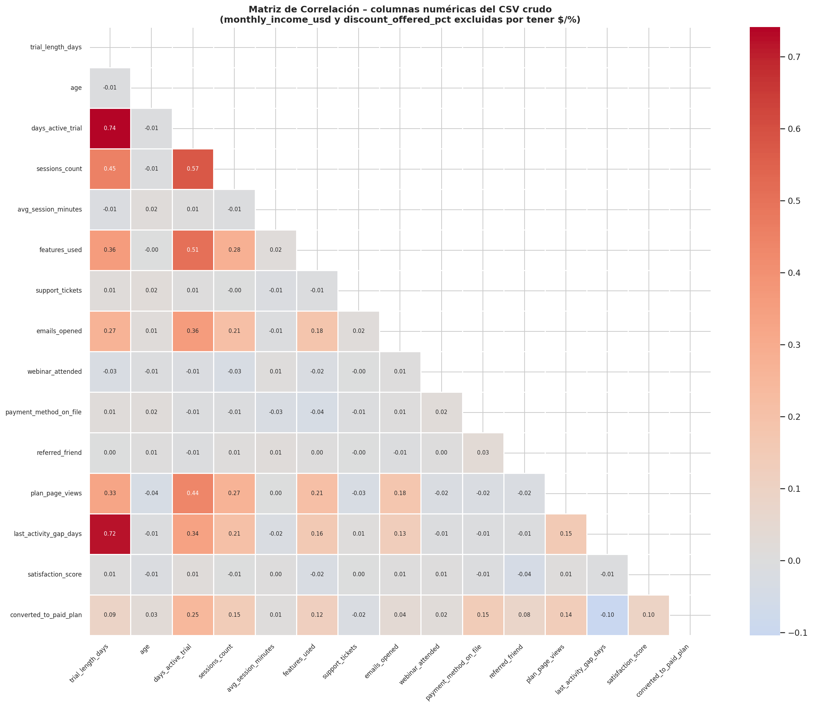

# Laboratorio 2 - ETL y Regresión Logística

Proyecto académico de ETL y modelado predictivo con **Regresión Logística** para predecir la conversión de usuarios de prueba (trial) a plan pago.

---

## Estructura del proyecto

```text
Laboratorio 2/
├── .idea/                                        # Configuración del IDE (JetBrains)
├── .venv/                                        # Entorno virtual local (no versionar)
├── datasets/
│   └── raw/
│       ├── lab2_data_dictionary.csv              # Diccionario de datos
│       └── lab2_trial_conversion_users.csv       # Dataset principal
├── documentos/
│   └── Laboratorio_2_ETL_Regresion_Logistica.pdf # Enunciado del laboratorio
├── EDA/
│   ├── 01_dist_variable_objetivo.png             # Distribución de la variable objetivo
│   ├── 02_valores_nulos.png                      # Porcentaje de valores nulos
│   ├── 03_tipos_de_datos.png                     # Tipos de datos del CSV crudo
│   ├── 04_dist_continuas.png                     # Distribución de variables continuas
│   ├── 05_dist_discretas.png                     # Distribución de variables discretas
│   ├── 06_dist_binarias.png                      # Distribución de variables binarias
│   ├── 07_dist_categoricas.png                   # Distribución de variables categóricas
│   ├── 08_categoricas_vs_objetivo.png            # Tasa de conversión por categoría
│   ├── 09_boxplots_por_conversion.png            # Boxplots numéricos vs. conversión
│   ├── 10_violin_plots.png                       # Violin plots variables clave
│   ├── 11_deteccion_outliers.png                 # Detección de outliers con IQR
│   └── 12_matriz_correlacion.png                 # Matriz de correlación
├── src/
│   ├── main.py                                   # Pipeline principal ETL + modelado
│   └── clases/
│       ├── __main__.py                           # Punto de entrada del módulo
│       ├── DataAnalysis.py                       # Clase para análisis exploratorio (EDA)
│       └── DataTransformer.py                    # Clase para transformación de datos
└── Readme.md
```

---

## Descripción de carpetas y módulos

| Ruta | Descripción |
|------|-------------|
| `datasets/raw/` | Datos fuente sin procesar, como están originalmente |
| `documentos/` | Enunciado y material académico del laboratorio |
| `EDA/` | Gráficas generadas durante el análisis exploratorio (datos crudos, sin limpiar) |
| `src/main.py` | Script principal con todo el pipeline ETL + entrenamiento + evaluación |
| `src/clases/DataAnalysis.py` | Clase `DataAnalysis`: carga y exploración del dataset (EDA) |
| `src/clases/DataTransformer.py` | Clase `DataTransformer`: comparación de tipos entre datasets, base para transformaciones |
| `src/clases/__main__.py` | Punto de entrada del paquete `clases` |

---

## Flujo del pipeline (`src/main.py`)

```
Extracción → EDA → Limpieza → Feature Engineering → Modelado → Evaluación
```

---

## Análisis Exploratorio de Datos (EDA)

> **Criterio de diseño:** todas las gráficas se generan sobre el **dataset crudo** sin ninguna transformación previa, 
> para poder identificar claramente los problemas originales de los datos (nulos, outliers, inconsistencias) y tomar decisiones informadas sobre la limpieza y transformación.
> Las gráficas se producen ejecutando `DataAnalysis.EDA()` desde `src/main.py` y se guardan automáticamente en la carpeta `EDA/`.

---

### 01 · Distribución de la variable objetivo


Balance de clases entre usuarios convertidos (1) y no convertidos (0).  
Permite identificar si existe desbalance que deba compensarse durante el modelado.

---

### 02 · Porcentaje de valores nulos por columna


Barras rojas indican columnas con valores nulos; azules indican columnas completas.  
Insumo directo para decidir la estrategia de imputación en `DataTransformer`.

---

### 03 · Tipos de datos del CSV crudo


Muestra el `dtype` real que Pandas asignó a cada columna al leer el CSV sin procesar.  
Columnas como `monthly_income_usd` y `discount_offered_pct` aparecen como `object` debido a los símbolos `$` y `%`.

---

### 04 · Distribución de variables continuas


Histograma + KDE con líneas de media (naranja) y mediana (verde) para `age`, `avg_session_minutes`, `satisfaction_score`, `monthly_income_usd` y `discount_offered_pct`.  
Un aviso rojo indica cuántos valores no pudieron parsearse por contener símbolos.

---

### 05 · Distribución de variables discretas


Histogramas con estadísticas incrustadas (n, μ, σ, mediana) para las variables de conteo:  
`trial_length_days`, `days_active_trial`, `sessions_count`, `features_used`, `support_tickets`, `emails_opened`, `plan_page_views` y `last_activity_gap_days`.

---

### 06 · Distribución de variables binarias


Conteos de las cuatro variables binarias: `webinar_attended`, `payment_method_on_file`, `referred_friend` y `converted_to_paid_plan`.  
Permite ver el desbalance en cada indicador de comportamiento.

---

### 07 · Distribución de variables categóricas (sin normalizar)


Top-20 valores por cada variable categórica tal como están en el CSV.  
Al **no** normalizar, se evidencian directamente inconsistencias como `"Colombia"`, `"colombia"`, `" COLOMBIA "` contados como categorías distintas.

---

### 08 · Tasa de conversión por variable categórica


Para cada valor categórico, qué porcentaje de los usuarios en esa categoría terminó convirtiéndose.  
Útil para identificar segmentos de alto o bajo potencial de conversión.

---

### 09 · Boxplots de variables numéricas vs. conversión


Comparación lado a lado (No Convertido vs. Convertido) de las 10 variables numéricas clave.  
Permite detectar diferencias de distribución que anticipen el poder discriminativo de cada variable.

---

### 10 · Violin plots de variables clave


Combina la forma de la distribución con los cuartiles internos para `days_active_trial`, `sessions_count`, `plan_page_views`, `features_used`, `satisfaction_score` y `last_activity_gap_days` segmentados por conversión.

---

### 11 · Detección de outliers — Método IQR


Histograma con límites inferior y superior del IQR (líneas rojas) y conteo de valores atípicos para `sessions_count`, `avg_session_minutes`, `features_used`, `monthly_income_usd`, `support_tickets` y `age`.  
Insumo para decidir si aplicar capeo o eliminación en la etapa de transformación.

---

### 12 · Matriz de correlación



Correlación de Pearson entre todas las columnas que ya son numéricas en el CSV crudo.  
`monthly_income_usd` y `discount_offered_pct` quedan excluidas por ser leídas como `object` (tienen `$`/`%`).

---

## Transformación — Limpieza

### 1. Extracción
- Carga del dataset desde `datasets/raw/lab2_trial_conversion_users.csv`.

### 2. Transformación — Limpieza
- Eliminación de duplicados por `user_id` (se conserva el último registro).
  - **Justificación:** Al revisar los datos, noté que algunos usuarios (user_id) aparecían repetidos. Decidí eliminar los duplicados,
    pero me aseguré de conservar siempre el último registro que aparecía en el archivo. La lógica detrás de esto es práctica:
    si un usuario tiene varias entradas a lo largo del tiempo, lo más seguro es que la última fila refleje su estado final o la información
    más actualizada de su perfil antes de terminar el periodo de prueba.
- Normalización de formatos: `device_type` (lowercase), columnas con `%` y `$`.
  - **Justificación:** El dataset venía con algunos problemas típicos de digitación.
    Por ejemplo, en el tipo de dispositivo (device_type) pasé todo a minúsculas y quité espacios para evitar que el modelo interprete
    'Mobile', 'mobile' y ' mobile ' como tres categorías distintas. Además, tuve que limpiar las columnas de dinero y descuentos quitando
    los símbolos de dólar ($) y porcentaje (%). Si dejaba esos símbolos, Python iba a leer esas columnas como texto puro, bloqueando por completo cualquier cálculo matemático en el modelo de regresión.
- Imputación de nulos: mediana para variables numéricas, `'desconocido'` para categóricas.
  - **Justificación:** Para las variables numéricas, opté por la mediana porque es más robusta frente a los outliers que la media.
    En cuanto a las variables categóricas, decidí usar 'desconocido' para marcar claramente los casos donde no se tiene información.
    Esto es importante porque el modelo puede aprender que 'desconocido' es una categoría válida y no simplemente un valor faltante, lo que podría ser útil para la predicción.
- Tratamiento de outliers con **método IQR** (capeo) en: `avg_session_minutes`, `monthly_income_usd`, `sessions_count`.
  - **Justificación:** En columnas como los minutos de sesión (avg_session_minutes), las sesiones totales (sessions_count) y el sueldo (monthly_income_usd),
    encontré valores extremos o absurdamente altos. En lugar de borrar las filas completas y perder el resto de la información útil de esos usuarios,
    apliqué una técnica estadística de límite o 'capeo' basada en el Rango Intercuartílico (IQR). Básicamente, si un valor se salía del rango normal,
    el código no lo eliminaba, sino que lo 'aterrizaba' al límite máximo o mínimo aceptable. Así logré que estos datos gigantes no desequilibraran los pesos del modelo, manteniendo el 100% de la muestra útil.

### 3. Feature Engineering
| Variable derivada | Descripción |
|---|---|
| `sessions_per_active_day` | Sesiones promedio por día activo |
| `total_minutes_used` | Minutos totales de uso estimados |
| `activity_intensity` | Interacción entre features usadas y días activos |
| `high_commercial_intent` | Flag binario: vistas de plan + método de pago registrado |

### 4. Modelado
- División: **60% train / 20% validación / 20% test** (estratificado).
- Escalado con `StandardScaler` (fit solo en train).
- Dos modelos:
  - **`statsmodels.Logit`**: inferencia estadística (p-values, coeficientes, intervalos de confianza).
  - **`sklearn.LogisticRegression`**: modelo predictivo.
  - Para el modelado se hicieron dos iteraciones: una con todas las variables y otra con selección basada en p-values (umbral 0.05) del modelo `statsmodels`.
    Esto me permitió comparar el rendimiento de un modelo completo frente a uno más parsimonioso, y evaluar si la eliminación de variables no significativas mejoraba o empeoraba la capacidad predictiva.

### 5. Evaluación
- Métricas en conjunto de prueba: Accuracy, Precision, Recall, F1-Score y ROC-AUC.
- Matriz de confusión detallada.
- Gráficos de curvas ROC y coeficientes exportados como `.png`.

---

## Requisitos

```txt
pandas
numpy
statsmodels
scikit-learn
matplotlib
seaborn
```

---

## Ejecución

```bash
# 1. Crear y activar el entorno virtual
python3 -m venv .venv
source .venv/bin/activate

# 2. Instalar dependencias
pip install pandas numpy statsmodels scikit-learn matplotlib seaborn

# 3. Ejecutar el pipeline
cd src
python3 main.py
```

---

## Salidas esperadas

### Gráficas EDA (carpeta `EDA/`)
| Archivo | Descripción |
|---------|-------------|
| `01_dist_variable_objetivo.png` | Balance de clases (bar + pie) |
| `02_valores_nulos.png` | % de nulos por columna |
| `03_tipos_de_datos.png` | Dtype real del CSV + tabla resumen |
| `04_dist_continuas.png` | Histograma + KDE con media y mediana |
| `05_dist_discretas.png` | Histogramas de variables de conteo |
| `06_dist_binarias.png` | Conteos de variables 0/1 |
| `07_dist_categoricas.png` | Top-20 valores sin normalizar |
| `08_categoricas_vs_objetivo.png` | Tasa de conversión por categoría |
| `09_boxplots_por_conversion.png` | Boxplots segmentados por target |
| `10_violin_plots.png` | Violin plots de variables clave |
| `11_deteccion_outliers.png` | Histogramas con límites IQR |
| `12_matriz_correlacion.png` | Correlaciones entre variables numéricas |

### Consola
- Resumen estadístico del modelo (`statsmodels`).
- Métricas de evaluación y matriz de confusión.

---

## Notas

- `.idea/` y `.venv/` son artefactos locales y deben excluirse del control de versiones (`.gitignore`).
- `DataTransformer.py` contiene la estructura base de la clase; el método `transform()` es extensible para futuras iteraciones del pipeline.
- Las gráficas EDA se generan **siempre sobre datos crudos** para no contaminar el análisis con decisiones de limpieza previas.

---

*Equipo de trabajo: Miguel Caycedo, Diego Teuta, Jhon Deivi Riascos, Luis Santiago Osorio Ortiz — ETL, Maestría UAO — 2026*
