# Laboratorio 2 - ETL y Regresión Logística

Proyecto académico de ETL y modelado predictivo con **Regresión Logística** para predecir la conversión de usuarios de prueba (trial) a plan pago.

---

## Estructura del proyecto

```text
Laboratorio 2/
├── .idea/                                        # Configuración del IDE (JetBrains)
├── .venv/                                        # Entorno virtual local (no versionar)
├── datasets/
│   ├── raw/
│   │   ├── lab2_data_dictionary.csv              # Diccionario de datos
│   │   └── lab2_trial_conversion_users.csv       # Dataset principal (crudo)
│   └── clean/
│       └── lab2_trial_conversion_users_clean.csv # Dataset limpio generado por el pipeline
├── documentos/
│   └── Laboratorio_2_ETL_Regresion_Logistica.pdf # Enunciado del laboratorio
├── EDA/
│   ├── 01_dist_variable_objetivo.png             # Distribución de la variable objetivo
│   ├── 02_valores_nulos.png                      # Porcentaje de valores nulos
│   ├── 03_tipos_de_datos.png                     # Tipos de datos del CSV crudo
│   ├── 04_dist_continuas.png                     # Distribución de variables continuas
│   ├── 05_dist_discretas.png                     # Distribución de variables discretas
│   ├── 06_dist_binarias.png                      # Distribución de variables binarias
│   ├── 07_dist_categoricas.png                   # Distribución de variables categóricas
│   ├── 08_categoricas_vs_objetivo.png            # Tasa de conversión por categoría
│   ├── 09_boxplots_por_conversion.png            # Boxplots numéricos vs. conversión
│   ├── 10_violin_plots.png                       # Violin plots variables clave
│   ├── 11_deteccion_outliers.png                 # Detección de outliers con IQR
├── src/
│   ├── main.py                                   # Pipeline principal ETL + modelado
│   ├── clases/
│   │   ├── __main__.py                           # Punto de entrada del módulo
│   │   ├── DataAnalysis.py                       # Clase para análisis exploratorio (EDA)
│   │   ├── DataTransformer.py                    # Clase para limpieza y transformación de datos
│   │   └── RegresionLogistica.py                 # Clase auxiliar para regresión logística (en desarrollo)
│   └── RegLogistica/
│       ├── 01 - Modelo no balanceado.png         # Resultados Modelo 1
│       ├── 02 - Modelo balanceado.png            # Resultados Modelo 2
│       └── 03 - Modelo variables mas significativas.png  # Resultados Modelo 3
└── Readme.md
```

---

## Descripción de carpetas y módulos

| Ruta | Descripción |
|------|-------------|
| `datasets/raw/` | Datos fuente sin procesar, tal como están originalmente |
| `datasets/clean/` | Dataset limpio y enriquecido generado por `DataTransformer` |
| `documentos/` | Enunciado y material académico del laboratorio |
| `EDA/` | Gráficas generadas durante el análisis exploratorio (datos crudos, sin limpiar) |
| `src/main.py` | Script principal: ETL + codificación + escalado + entrenamiento + evaluación |
| `src/clases/DataAnalysis.py` | Clase `DataAnalysis`: carga y exploración del dataset (EDA) |
| `src/clases/DataTransformer.py` | Clase `DataTransformer`: pipeline completo de limpieza, imputación, outliers y feature engineering |
| `src/clases/RegresionLogistica.py` | Clase `RegresionLogistica`: auxiliar para encapsular lógica de modelado (en desarrollo) |
| `src/clases/__main__.py` | Punto de entrada del paquete `clases` |
| `src/RegLogistica/` | Gráficas de evaluación de los tres modelos entrenados |

---

## Flujo del pipeline (`src/main.py`)

```
Extracción → Limpieza → Feature Engineering → Codificación → Escalado → Inferencia estadística → Modelado → Evaluación
```

---

## Análisis Exploratorio de Datos (EDA)

> **Criterio de diseño:** todas las gráficas se generan sobre el **dataset crudo** sin ninguna transformación previa,
> para poder identificar claramente los problemas originales de los datos (nulos, outliers, inconsistencias) y tomar decisiones informadas sobre la limpieza y transformación.
> Las gráficas se producen ejecutando `DataAnalysis.EDA()` y se guardan automáticamente en la carpeta `EDA/`.

---

### 01 · Distribución de la variable objetivo

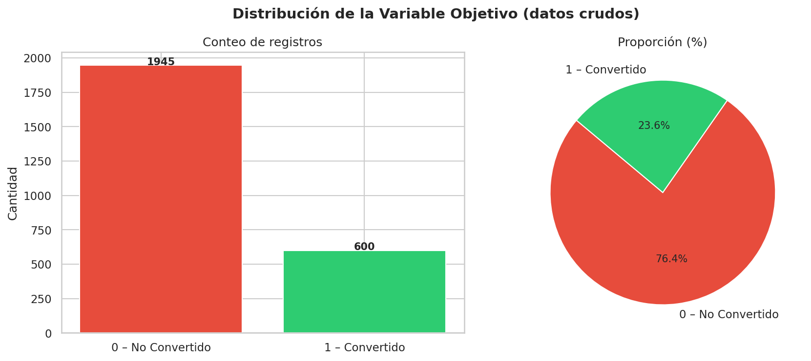

Balance de clases entre usuarios convertidos (1) y no convertidos (0).  
Permite identificar si existe desbalance que deba compensarse durante el modelado.

---

### 02 · Porcentaje de valores nulos por columna

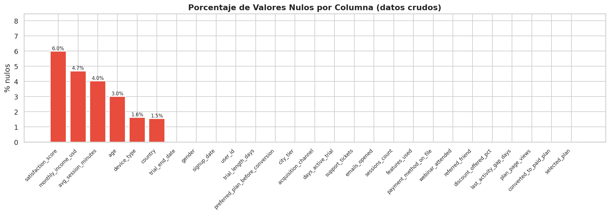

Barras rojas indican columnas con valores nulos; azules indican columnas completas.  
Insumo directo para decidir la estrategia de imputación en `DataTransformer`.

---

### 03 · Tipos de datos del CSV crudo

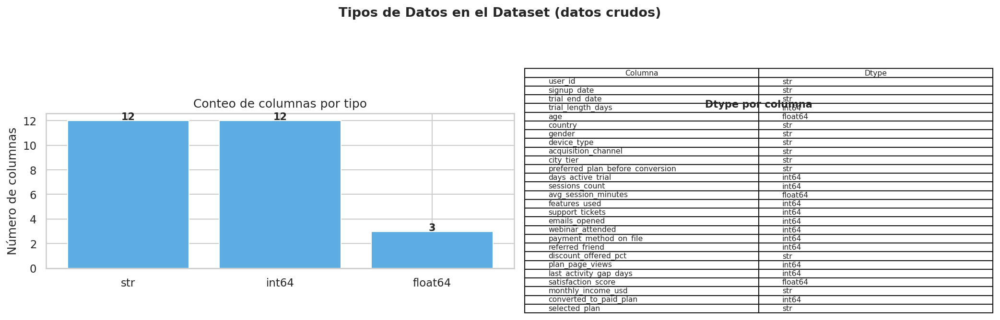

Muestra el `dtype` real que Pandas asignó a cada columna al leer el CSV sin procesar.  
Columnas como `monthly_income_usd` y `discount_offered_pct` aparecen como `object` debido a los símbolos `$` y `%`.

---

### 04 · Distribución de variables continuas

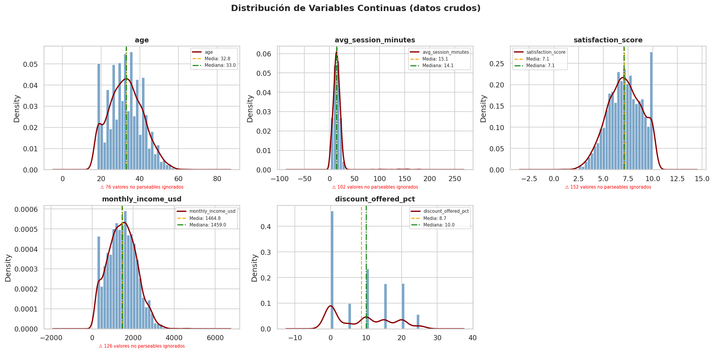

Histograma + KDE con líneas de media (naranja) y mediana (verde) para `age`, `avg_session_minutes`, `satisfaction_score`, `monthly_income_usd` y `discount_offered_pct`.  
Un aviso rojo indica cuántos valores no pudieron parsearse por contener símbolos.

---

### 05 · Distribución de variables discretas

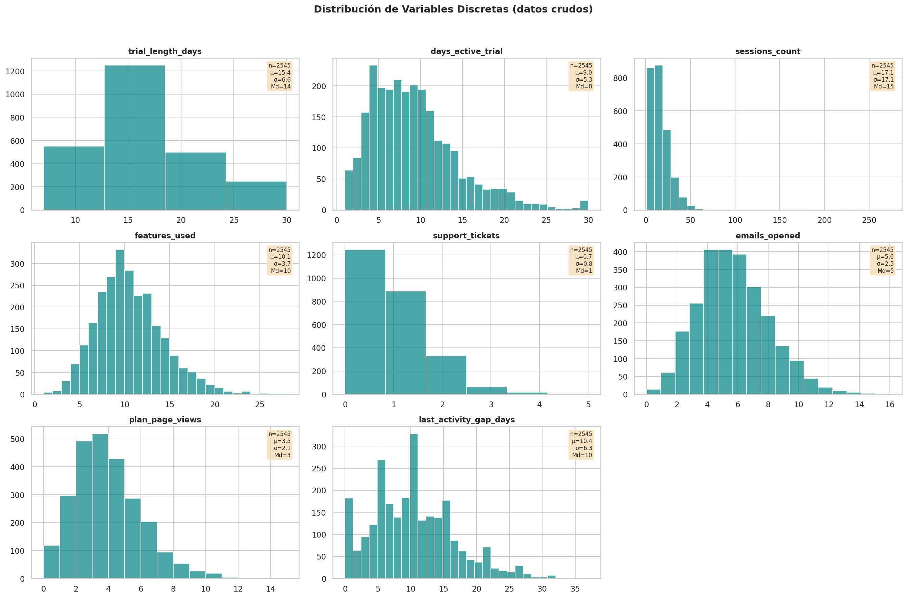

Histogramas con estadísticas incrustadas (n, μ, σ, mediana) para las variables de conteo:  
`trial_length_days`, `days_active_trial`, `sessions_count`, `features_used`, `support_tickets`, `emails_opened`, `plan_page_views` y `last_activity_gap_days`.

---

### 06 · Distribución de variables binarias

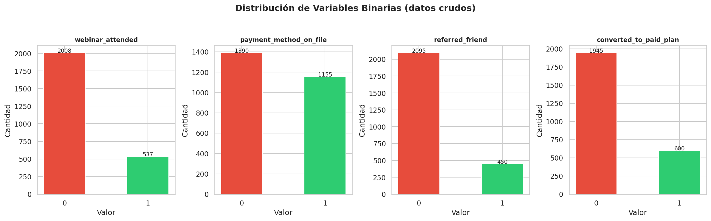

Conteos de las cuatro variables binarias: `webinar_attended`, `payment_method_on_file`, `referred_friend` y `converted_to_paid_plan`.  
Permite ver el desbalance en cada indicador de comportamiento.

---

### 07 · Distribución de variables categóricas (sin normalizar)

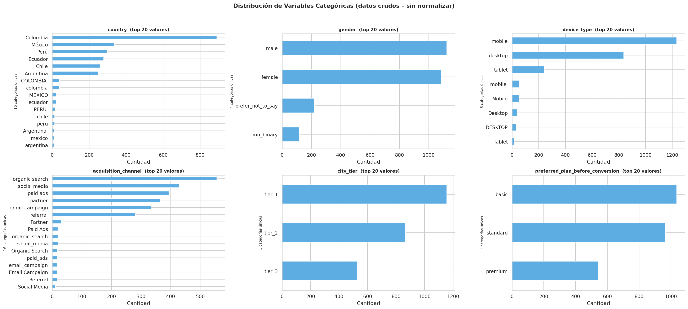

Top-20 valores por cada variable categórica tal como están en el CSV.  
Al **no** normalizar, se evidencian directamente inconsistencias como `"Colombia"`, `"colombia"`, `" COLOMBIA "` contados como categorías distintas.

---

### 08 · Tasa de conversión por variable categórica

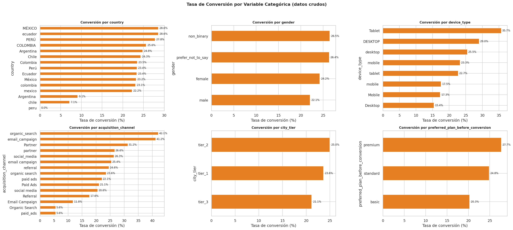

Para cada valor categórico, qué porcentaje de los usuarios en esa categoría terminó convirtiéndose.  
Útil para identificar segmentos de alto o bajo potencial de conversión.

---

### 09 · Boxplots de variables numéricas vs. conversión

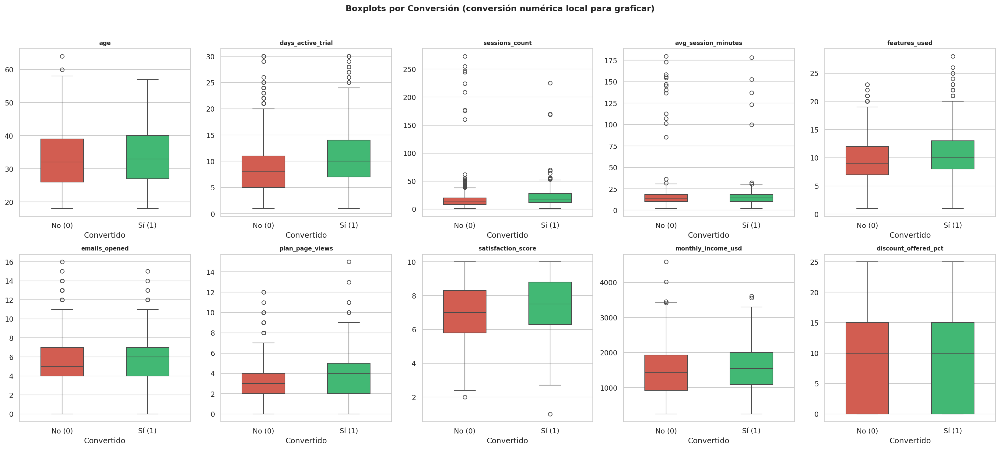

Comparación lado a lado (No Convertido vs. Convertido) de las 10 variables numéricas clave.  
Permite detectar diferencias de distribución que anticipen el poder discriminativo de cada variable.

---

### 10 · Violin plots de variables clave

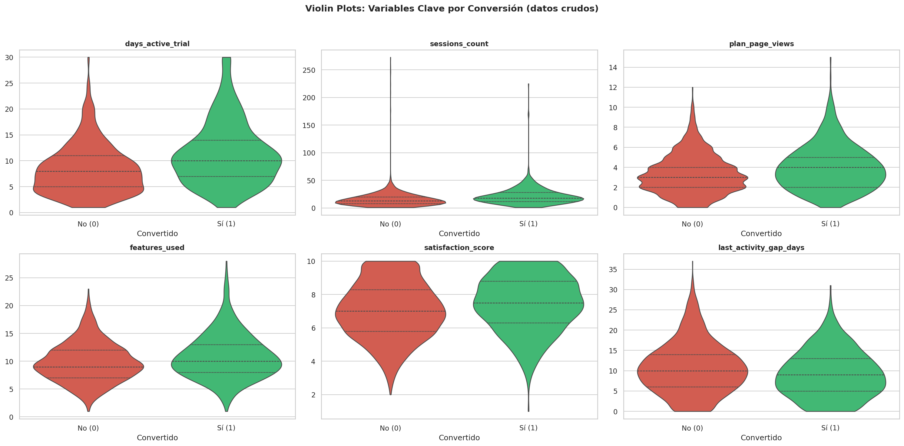

Combina la forma de la distribución con los cuartiles internos para `days_active_trial`, `sessions_count`, `plan_page_views`, `features_used`, `satisfaction_score` y `last_activity_gap_days` segmentados por conversión.

---

### 11 · Detección de outliers — Método IQR

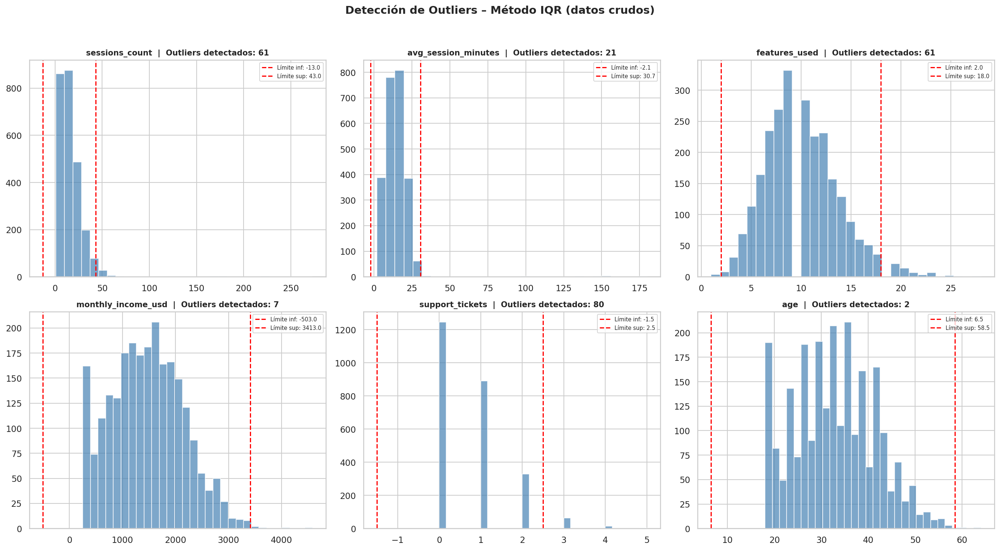

Histograma con límites inferior y superior del IQR (líneas rojas) y conteo de valores atípicos para `sessions_count`, `avg_session_minutes`, `features_used`, `monthly_income_usd`, `support_tickets` y `age`.  
Insumo para decidir si aplicar capeo o eliminación en la etapa de transformación.

---

## Transformación — Limpieza (`DataTransformer`)

### 1. Extracción
- Carga del dataset desde `datasets/raw/lab2_trial_conversion_users.csv`.

### 2. Limpieza
- **A. Verificación de tipos** contra el diccionario de datos (`lab2_data_dictionary.csv`). Se imprime una tabla comparativa antes y después de cada transformación para validar los `dtype` resultantes.
- **B. Corrección de fechas** en `signup_date` y `trial_end_date`, soportando formatos mixtos (`YYYY-MM-DD`, `DD/MM/YYYY`, `MM-DD-YYYY`).
- **C. Eliminación de duplicados** por `user_id`, conservando el último registro.
  - **Justificación:** el registro más reciente refleja el estado final del usuario antes de terminar el periodo de prueba.
- **D. Ajuste de formatos numéricos**: normalización de `device_type` (lowercase + strip), eliminación de `%` en `discount_offered_pct` y de `$` en `monthly_income_usd` para convertirlos a `float`.
  - **Justificación:** sin esta limpieza, Python trata esas columnas como texto puro, bloqueando cualquier cálculo matemático en el modelo.
- **E. Imputación de nulos**: mediana para `age`, `avg_session_minutes`, `satisfaction_score`, `monthly_income_usd`; valor `'desconocido'` para `device_type` y `country`.
  - **Justificación:** la mediana es más robusta frente a outliers que la media. `'desconocido'` permite que el modelo trate la ausencia de información como una categoría válida.
- **F. Tratamiento de outliers** con **método IQR** (capeo) en: `avg_session_minutes`, `monthly_income_usd`, `sessions_count`.
  - **Justificación:** en lugar de eliminar filas y perder información, los valores extremos se "aterrizan" al límite máximo o mínimo aceptable, conservando el 100% de la muestra.

### 3. Feature Engineering
| Variable derivada | Descripción |
|---|---|
| `sessions_per_active_day` | Sesiones promedio por día activo en el trial |
| `total_minutes_used` | Minutos totales de uso estimados (`sessions_count × avg_session_minutes`) |
| `activity_intensity` | Interacción entre features usadas y días activos |
| `high_commercial_intent` | Flag binario: vistas de plan > 1 **y** método de pago registrado |

El dataset limpio y enriquecido se guarda en `datasets/clean/lab2_trial_conversion_users_clean.csv`.

---

## Modelado (`src/main.py`)

### Preparación de features
- Codificación one-hot con `pd.get_dummies(..., drop_first=True, dtype=int)` para las variables categóricas: `country`, `gender`, `device_type`, `acquisition_channel`, `city_tier`, `preferred_plan_before_conversion`.
- Columnas excluidas del modelo: `user_id`, `signup_date`, `trial_end_date`, `selected_plan`.
- Variable objetivo: `converted_to_paid_plan`.

### División del dataset
| Conjunto | Proporción | Uso |
|----------|-----------|-----|
| Train | 60 % | Ajuste de parámetros y scaler |
| Validación | 20 % | Disponible para tuning (no activo actualmente) |
| Test | 20 % | Evaluación final de cada modelo |

División estratificada por `converted_to_paid_plan` con `random_state=42`.

### Escalado
`StandardScaler` ajustado **solo** sobre el conjunto de entrenamiento; transformación aplicada a validación y test sin re-ajuste.

### Inferencia estadística — `statsmodels`
Se ajusta un modelo `Logit` sobre el conjunto de entrenamiento para obtener coeficientes, p-values e intervalos de confianza de cada variable. Los resultados orientan la selección de features para el Modelo 3.

### Modelos predictivos — `sklearn`

| # | Configuración | Features |
|---|--------------|---------|
| **Modelo 1** | `LogisticRegression(random_state=42, max_iter=1000)` — sin balanceo | Todas las variables codificadas |
| **Modelo 2** | `LogisticRegression(random_state=42, max_iter=1000, class_weight='balanced')` | Todas las variables codificadas |
| **Modelo 3** | `LogisticRegression(random_state=42, max_iter=1000, class_weight='balanced')` | Features seleccionadas (ver tabla) |

**Features seleccionadas para el Modelo 3:**

| Feature | Tipo |
|---------|------|
| `last_activity_gap_days` | Numérica |
| `satisfaction_score` | Numérica |
| `referred_friend` | Binaria |
| `monthly_income_usd` | Numérica |
| `discount_offered_pct` | Numérica |
| `payment_method_on_file` | Binaria |
| `age` | Numérica |
| `gender_*` | Dummies (one-hot) |
| `preferred_plan_before_conversion_*` | Dummies (one-hot) |

### Evaluación
Cada modelo se evalúa sobre el **conjunto de prueba (20%)** con las siguientes métricas:
- Accuracy, Precision, Recall, F1-Score, ROC-AUC
- Matriz de confusión detallada: Verdaderos Positivos, Verdaderos Negativos, Falsos Positivos, Falsos Negativos

---

## Resultados de los modelos

### Modelo 1 — No balanceado (todas las variables)


### Modelo 2 — Balanceado (todas las variables)


### Modelo 3 — Balanceado (variables más significativas)


## Conclusiones
Para cerrar este laboratorio, la principal lección que nos llevo es que construir un buen modelo predictivo no se trata solamente de meter datos en Scikit-Learn y celebrar si el Accuracy da alto. 
Durante la fase del ETL, nos dimos cuenta de lo fácil que es arruinar un proyecto desde el principio si uno simplemente le da dropna() a los valores nulos o borra los valores atípicos. 
Tomarse el tiempo de limpiar los datos con criterio técnico (como usar la mediana o limitar los extremos con el método IQR) fue lo que realmente nos permitió salvar la información de los usuarios sin meter ruido falso.
Por otro lado, la evolución por la que pasaron los tres modelos nos dejó clarísimo el impacto que tienen las decisiones que tomamos en el código. Fue un golpe de realidad ver cómo el primer modelo nos engañaba con una exactitud casi del 80%, 
cuando en la práctica estaba dejando escapar a casi todos los clientes que sí querían pagar. Balancear las clases fue una decisión obligada para este laboratorio porque hay desbalance significativo entre los que adquiere el plan y los que no.
Finalmente, el ejercicio de limpiar las variables usando Statsmodels fue el toque de gracia. Nos sirvio para entender que no todas las variables que tenemos a disposición son realmente útiles para predecir la conversión, y que a veces menos es más.

---

## Requisitos

```txt
pandas
numpy
statsmodels
scikit-learn
matplotlib
seaborn
```

---

## Ejecución

```bash
# 1. Crear y activar el entorno virtual
python3 -m venv .venv
source .venv/bin/activate

# 2. Instalar dependencias
pip install pandas numpy statsmodels scikit-learn matplotlib seaborn

# 3. Ejecutar el pipeline
cd src
python3 main.py
```

---

## Salidas esperadas

### Gráficas EDA (carpeta `EDA/`)
| Archivo | Descripción |
|---------|-------------|
| `01_dist_variable_objetivo.png` | Balance de clases (bar + pie) |
| `02_valores_nulos.png` | % de nulos por columna |
| `03_tipos_de_datos.png` | Dtype real del CSV + tabla resumen |
| `04_dist_continuas.png` | Histograma + KDE con media y mediana |
| `05_dist_discretas.png` | Histogramas de variables de conteo |
| `06_dist_binarias.png` | Conteos de variables 0/1 |
| `07_dist_categoricas.png` | Top-20 valores sin normalizar |
| `08_categoricas_vs_objetivo.png` | Tasa de conversión por categoría |
| `09_boxplots_por_conversion.png` | Boxplots segmentados por target |
| `10_violin_plots.png` | Violin plots de variables clave |
| `11_deteccion_outliers.png` | Histogramas con límites IQR |

### Gráficas de modelos (carpeta `src/RegLogistica/`)
| Archivo | Descripción |
|---------|-------------|
| `01 - Modelo no balanceado.png` | Evaluación Modelo 1 |
| `02 - Modelo balanceado.png` | Evaluación Modelo 2 |
| `03 - Modelo variables mas significativas.png` | Evaluación Modelo 3 |

### Dataset limpio (carpeta `datasets/clean/`)
| Archivo | Descripción |
|---------|-------------|
| `lab2_trial_conversion_users_clean.csv` | Dataset final con datos limpios y features derivadas |

### Consola
- Tabla comparativa de dtype por columna (antes y después de cada transformación).
- Resumen estadístico completo del modelo `statsmodels` (coeficientes, p-values, intervalos de confianza).
- Métricas de evaluación y matriz de confusión para los tres modelos sobre el conjunto de prueba.

---

## Notas

- `.idea/` y `.venv/` son artefactos locales y deben excluirse del control de versiones (`.gitignore`).
- La evaluación sobre el conjunto de **validación** está disponible en `main.py` pero desactivada; se puede habilitar descomentando las líneas `evaluar_modelo(..., X_val_scaled, ...)`.
- `RegresionLogistica.py` es una clase auxiliar actualmente en desarrollo para encapsular la lógica de modelado fuera del script principal.
- Las gráficas EDA se generan **siempre sobre datos crudos** para no contaminar el análisis con decisiones de limpieza previas.

---

*Equipo de trabajo: Miguel Caycedo, Diego Teuta, Jhon Deivi Riascos, Luis Santiago Osorio Ortiz — ETL, Maestría UAO — 2026*
